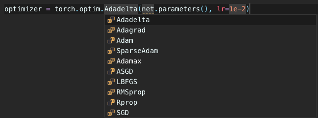

# Task4

### 引入模块，读取数据

### 构建计算图（构建网络模型）

### 损失函数与优化器

优化器在pytorch中的进行了封装，我们不需要重复造轮子，如下图所示
 
* SGD：BATCH GRADIENT DESCENT
在每一轮的训练中，Batch Gradiant Descent算法用 ###整个训练集的数据计算cost function的梯度，并用该梯度对模型参数进行更新：
$$\theta = \theta - \alpha$$
* Mini=batch Fradient Descent
* Momentum 
* Ne
* BGD
* 动量
* adam
* 。。。

### 开始训练模型

### 对训练的模型预测结果进行评估
